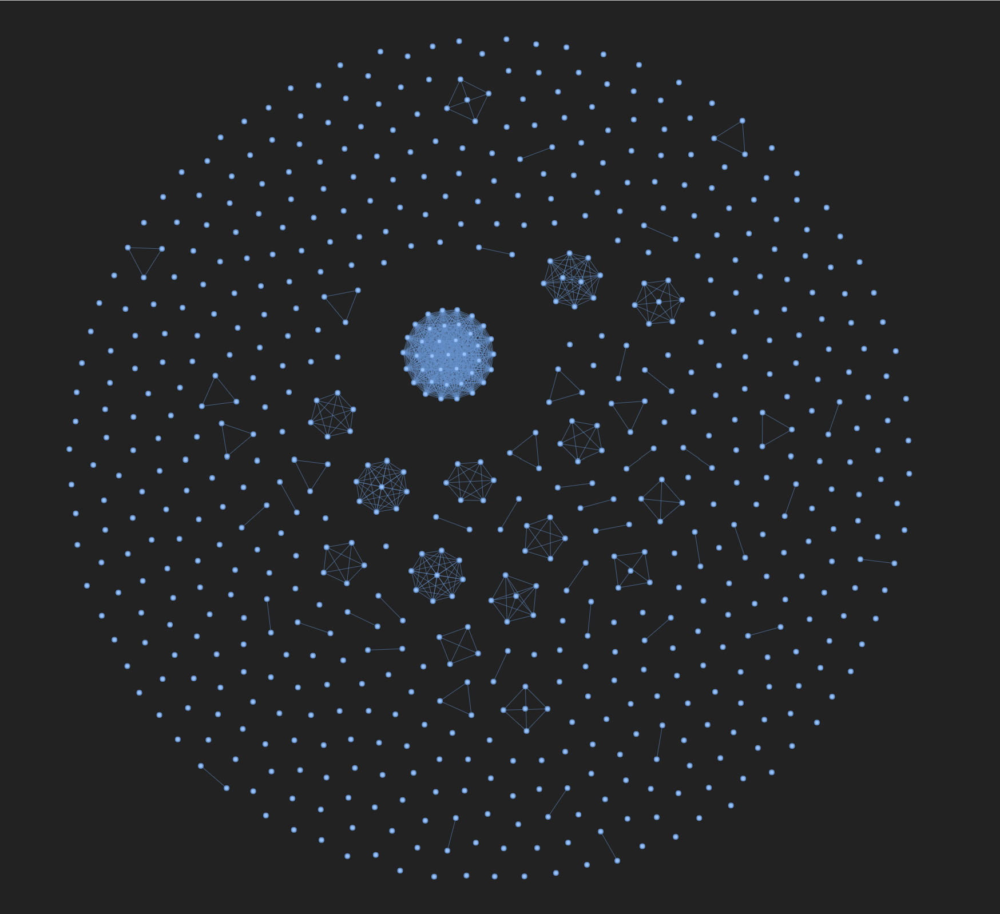

# LinkScape: LinkedIn Network Visualizer



A powerful tool that transforms your LinkedIn connections into an interactive network visualization. LinkScape helps you understand your professional network by creating visual representations of how your connections are clustered by company and how they're interconnected.

## Features

### Interactive Visualization
- **Dynamic Graph View**: Explore your network through an interactive PyVis graph
- **Smart Clustering**: Connections are automatically grouped by company
- **Node Details**: Hover over any connection to view their:
  - Full name
  - Current position
  - Company affiliation
- **Zoom & Pan**: Navigate through your network with intuitive controls
- **Search**: Quickly find specific connections in your network
- **Stable Layout**: Consistent visualization with optimized physics settings

### Visual Customization
- **Dark Mode Interface**: Easy on the eyes with a dark theme
- **Responsive Design**: Works seamlessly on desktop and mobile devices
- **Custom Node Colors**: Different companies are represented by distinct colors
- **Connection Lines**: Visualize relationships between connections
- **Optimized Node Spacing**: Prevents node overlap for better readability
- **Smooth Physics**: Enhanced force-directed layout for better visualization

### Data Analysis
- **Company Clusters**: See how your network is distributed across different organizations
- **Connection Density**: Identify areas of your network with the most connections
- **Network Insights**: Discover patterns in your professional relationships
- **Detailed Statistics**: View comprehensive network metrics and analytics

## Tech Stack
- **Python 3.8+**: Core programming language
- **Pandas**: Data manipulation and analysis
  - Handles CSV parsing
  - Data cleaning and transformation
  - NaN value handling
- **NetworkX**: Graph creation and analysis
  - Network structure creation
  - Graph algorithms
  - Node and edge management
- **PyVis**: Interactive network visualization
  - Dynamic graph rendering
  - Interactive features
  - Physics-based layout

## Installation

### Prerequisites
- Python 3.8 or higher
- pip (Python package installer)
- Git (for cloning the repository)

### Step-by-Step Installation
1. Clone this repository:
```bash
git clone https://github.com/yourusername/LinkScape.git
cd LinkScape
```

2. Create a virtual environment (recommended):
```bash
# Windows
python -m venv venv
.\venv\Scripts\activate

# macOS/Linux
python3 -m venv venv
source venv/bin/activate
```

3. Install the required dependencies:
```bash
pip install -r requirements.txt
```

## Usage

### Preparing Your Data
1. Export your LinkedIn connections:
   - Go to LinkedIn Settings & Privacy
   - Navigate to "Data Privacy"
   - Click "Get a copy of your data"
   - Select "Connections" and request download
   - Wait for the email with your data
   - Extract the CSV file from the downloaded archive

2. Ensure your CSV file contains these columns:
   - `First Name` (required): First name of the connection
   - `Last Name` (required): Last name of the connection
   - `Company` (required): Current company/organization
   - `Position` (optional): Current job title
   - Additional columns will be preserved but not used in visualization

### Running the Visualization
1. Place your LinkedIn connections CSV file in the project directory
2. Run the visualization script:
```bash
python linkedin_network_visualizer.py
```
3. Open the generated `linkedin_network.html` in your web browser
4. Interact with the visualization:
   - Click and drag nodes to rearrange
   - Use mouse wheel to zoom in/out
   - Hover over nodes for details
   - Click and drag background to pan
   - Use the search box to find specific connections
   - Adjust physics settings for optimal layout

## Troubleshooting

### Common Issues
1. **CSV File Not Found**
   - Ensure the CSV file is in the correct directory
   - Check if the filename matches exactly (case-sensitive)
   - Verify file permissions

2. **Missing Dependencies**
   - Run `pip install -r requirements.txt` again
   - Check Python version: `python --version`
   - Verify virtual environment activation

3. **Visualization Not Loading**
   - Clear browser cache
   - Try a different web browser
   - Check browser console for errors
   - Ensure the HTML file was generated successfully

4. **Layout Inconsistencies**
   - The visualization uses a force-directed layout
   - Each run may produce slightly different layouts
   - Use the physics controls to adjust the layout
   - Try different stabilization settings


